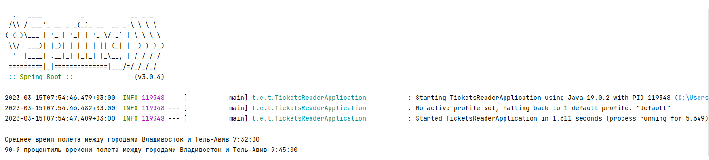

# Задача

Напишите программу на языке программирования java, которая прочитает файл [tickets.json](./assets/tickets.json) и рассчитает:
- среднее время полета между городами Владивосток и Тель-Авив
- 90-й процентиль времени полета между городами Владивосток и Тель-Авив

Программа должна вызываться из командной строки Linux, результаты должны быть представлены в текстовом виде.

# Запуск
**Выполняется из командной строки в docker контейнере** *(требуется иметь установленный docker)*:
1. Открыть корневую папку проекта в консоли
2. Собрать проект. Например, при помощи команд `mvn clean`, затем `mvn package`.
3. Выполнить `docker build -t {image_name} .`.
4. При запуске контейнера без аргументов, будут рассчитаны значения по умолчанию из задания. Команда в консоли: `docker run {image_name}`
5. Можно передать аргументы при запуске `docker run -v {host_directory}:{directory_in_container}  {image_name} {path_file_in_container} {city1} {city2}`, где:
   
   - ***-v {host_directory}:{directory_in_container}*** - *обязательный параметр, содержит путь к директории на хосте и соответствующий ему в контейнере (в случае отсутствия указанных директорий они будут созданы);*
   - ***{image_name}*** - *название образа, который был создан командой `build`;*
   - ***{path_file_in_container}*** - *путь к файлу в файловой структуре контейнера;*
   - ***{city1}, {city2}*** - *названия городов, очередность не имеет значения;*
   - ***обязательно соблюдать очередность пути к файлу и названий городов*** - *путь к файлу указывается первым аргументом*

# Результат

